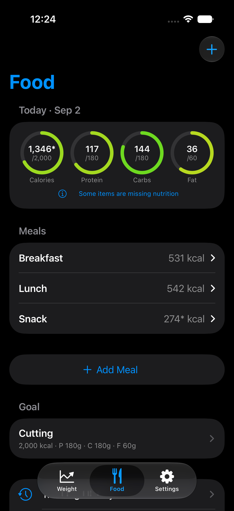
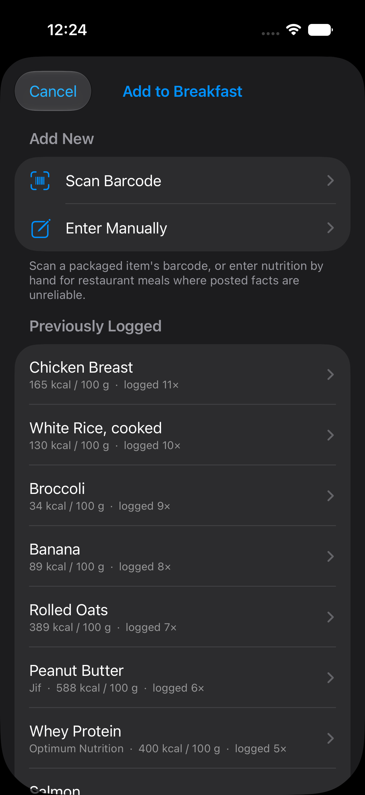
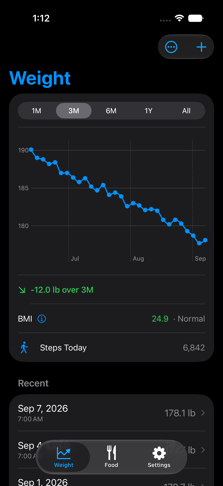
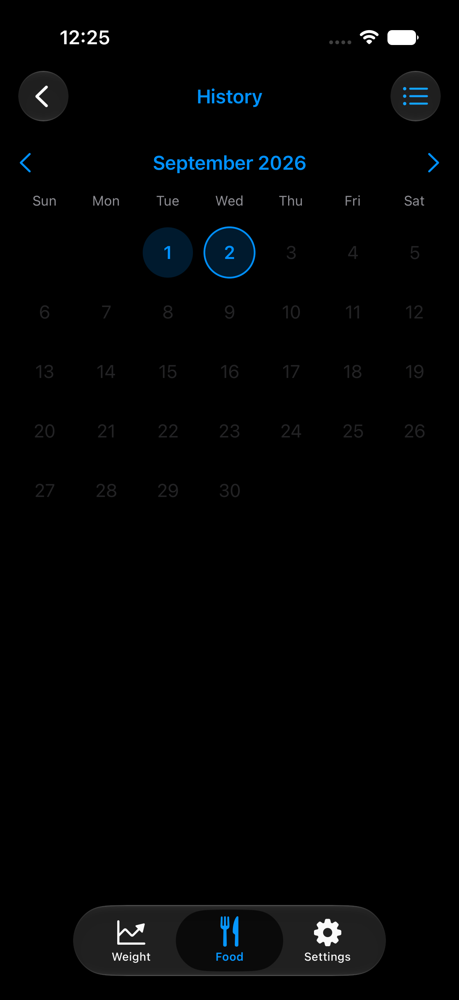
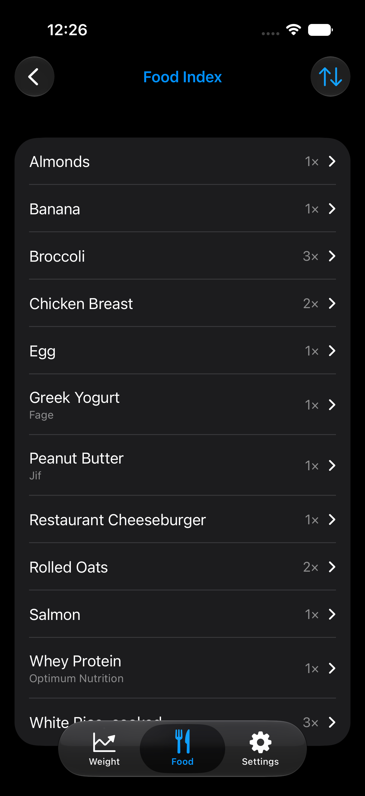
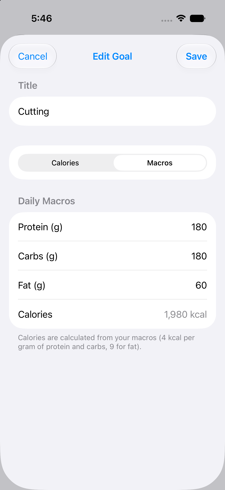
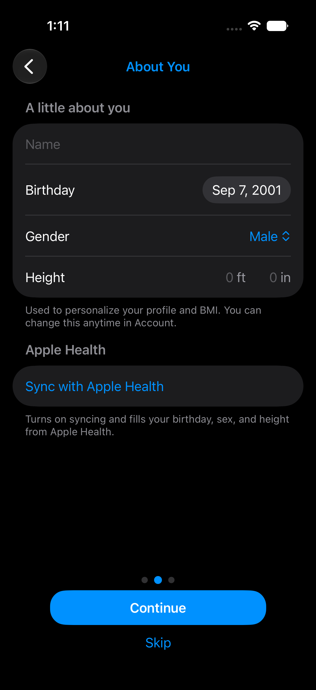
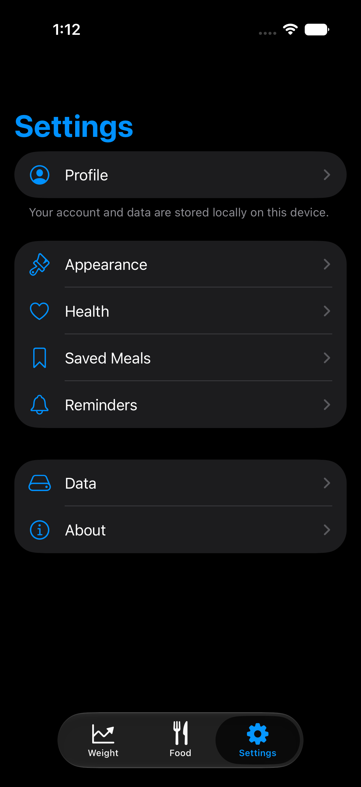
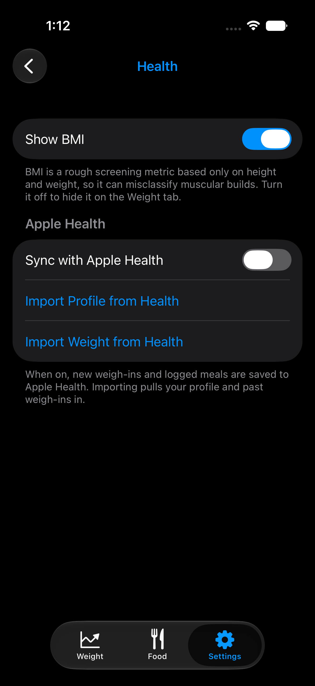

# DietBuddy

A SwiftUI + SwiftData iOS app for tracking food, weight, and nutrition goals.

## Motivation

DietBuddy is a **"no-code" experiment**: the entire app was built by directing an AI
coding assistant rather than by writing the code by hand. The goals of the project are to:

- See how far a fully AI-driven workflow can go in building a real, functional iOS app.
- Learn how to use AI effectively in day-to-day software development — how to prompt,
  review, iterate, and course-correct.
- Explore modern SwiftUI, SwiftData, and Swift concurrency along the way.

Every feature, refactor, and bug fix in this repository was produced through that
human-in-the-loop, AI-assisted process. In this project, I didn't write anything —
not a single line of code, not even this README.

## Features

- **Food logging** — build up a day from user-created meals (Breakfast, Lunch, or numbered),
  with macro progress rings that fill toward your goal and shift red → green → purple.
- **Adding food** — scan a barcode (looked up via Open Food Facts) or enter nutrition by
  hand. Foods are measured by weight (g / oz, per 100 g); drinks are detected automatically
  and measured by volume (fl oz / mL, per fl oz).
- **Previously logged foods** — quickly re-log anything you've had before, searchable and
  sortable, so routine items don't need re-scanning.
- **Saved meals** — save a logged meal and re-add it later as a single collapsible bundle.
- **Tracking history** — browse past days as a scrollable feed or a month calendar, drill
  into any day, and see a **Food Index** of every food you've logged with averages and totals.
- **Weight tracking** — log weigh-ins, see a trend chart over an adjustable period (with an
  optional calorie-intake overlay), view BMI (which can be turned off), and edit full history.
- **Goals** — keep multiple nutrition goals with one "active" goal driving the day's targets.
  Set them by macros or by a calorie target split across presets (Balanced, High Protein,
  Low Carb, Low Fat) or a custom P/C/F ratio — calories and macros always stay consistent.
  Tap a goal to view it, then Edit to make changes.
- **Apple Health** — opt in to sync weigh-ins and logged nutrition to Health, import your
  profile (birthday, sex, height) and past weigh-ins, and see today's step count on the
  Weight tab.
- **Home-screen widget** — daily macro totals at a glance via WidgetKit + an App Group.
- **Reminders** — optional local check-in notifications.
- **Onboarding** — a three-phase first-run intro that captures optional profile details (or
  imports them from Apple Health) and lets you choose an accent color.
- **Settings** — organized into categories (Profile, Appearance, Health, Saved Meals,
  Reminders, Data, About): appearance/accent/units, BMI + Apple Health sync, reminders, a
  storage summary with reset-all-data, and app info.

### Screenshots

> Images live in [`Screenshots/`](Screenshots/). Drop PNGs with the names below in that
> folder and they'll render here.

| Food (Today) | Add Food | Weight & BMI |
| --- | --- | --- |
|  |  |  |

| History Calendar | Food Index | Goal Editor |
| --- | --- | --- |
|  |  |  |

| Onboarding | Settings | Health |
| --- | --- | --- |
|  |  |  |

## Requirements

- iOS 26.0+
- Xcode with the iOS 26 SDK

## Project structure

```
DietBuddy/
├── App/            # App entry point, root tab view, onboarding
├── Models/         # SwiftData models (Food, Meal, MealItem, WeightEntry, Goal,
│                   #   SavedMeal, SavedMealItem, UserProfile, PortionUnit, Gender)
├── Services/       # Open Food Facts lookup, reminder scheduling, Apple Health (HealthKit)
├── Support/        # Theme, BMI + macro math, DEBUG sample data, shared widget store
├── Views/
│   ├── Weight/     # Trend chart, history, BMI, weigh-in editor
│   ├── Food/
│   │   ├── Today/    # The day's meals and adding meals/items
│   │   ├── Entry/    # Barcode scan, manual entry, food library
│   │   ├── History/  # List/calendar history, per-day view, food index
│   │   └── Detail/   # Item and saved-meal-bundle detail
│   ├── Goals/      # Goal list, editor, and read-only detail
│   ├── SavedMeals/ # Saved-meal management and picking
│   ├── Settings/   # Settings categories (appearance, health, reminders, data, about) + profile
│   └── Components/  # Reusable views (buttons, fields, pickers, effects, empty state)
└── DietBuddyWidget/ # WidgetKit extension (daily macros)
```

## Notes

- Nutrition for logged items is **snapshotted** at log time, so editing the Food library
  later never changes past entries.
- Nutrition is stored per 100 g internally; drinks display/enter per fl oz (≈ 1 g/mL).
- Sample data is seeded only in **DEBUG** builds and never ships in release.
- Apple Health sync is **opt-in** and requires the HealthKit capability plus the Health usage
  strings; without them the app still builds and runs, just without Health features.
- To run on a physical device you'll need to set your own bundle identifier and signing team.

## Development

See [AGENTS.md](AGENTS.md) for the conventions the AI assistant follows when working in
this repository.
